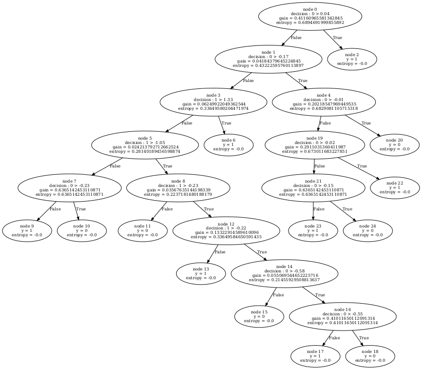

# assignment_q2_subjective_answers



Usage of out decision is similar to that of sklearn's decision tree. You can
follow below general steps to train the decision tree.

Step 1 :- Import ``DecisionTree`` class from tree.base
Step 2 :- make an object of ``DecisionTree`` class (while doing this you can modify 
          some attributes like ``criterion`` and ``max_depth`` according to your choice.)
Step 3 :- Fit the model using ``fit`` function of ``DecisionTree`` class(you have to
          provide train data in this function according to documentation).
Step 4 :- Predict the results using ``predict`` function of ``DecisionTree`` class
          by providing test data.
Step 5 :- Now, you will have predicted results of test data which can be used for
          various purposes like finding accuracy, precision and etc (for this you
          can use functions of utils file which is located inside tree folder).

Now, first of all to split data into 7:3 raio, we used iloc function of pandas and 
stored this data in ``train_data_X``, ``train_data_y``, ``test_data_X`` and
``test_data_y``.

After doing this, we followed above 5 steps to find various accuracy parameters like 
accuracy, per-class precision and recall of the decision tree we implemented. And 
values of these metrics are as follows according to out default model (One before 
optimizing any hyperparameters) :-
Decision Tree with ``max_depth`` = 5 and ``criterion`` = information_gain(MSE)
```
Accuracy :- 0.9
Precision :- 
            For y=1 :- 0.8947368421052632
            For y=0 :- 0.9090909090909091
Recall :- 
            For y=1 :- 0.9444444444444444
            For y=0 :- 0.8333333333333334
```

Now, to optimize the ``max_depth``, we will use kfold method of ``sklearn`` library.

Using the kfold funciton we split the data of ``train_data_X`` and ``train_data_y``
into train and validation data, although we are not storing it because we are using
this validation and train data only once so storing the value is unnecessary. And
here we have made sure that when we are using nested cross validation, data
remains same for all models.

Then, we have varied the ``max_depth`` from 1 to 8 (upper bound is set to 8 because the 
maximum depth that tree can take is 8 only at depth 8 it will give 100% accuracy and hence 
even if we want to increase the depth it will not increase the depth because then the value 
of gain will be zero) and for each value of 
``max_depth`` we are training the decision tree model for all 5 folds and then we 
are taking the average of all the accuracy for a particular value of ``max_depth`` 
and by this way we are finding the best value of ``max_depth``. According to our 
observations, we found that ``max_depth`` = 2 is the best value for ``max_depth`` 
for this particular dataset. And at this max_depth we are getting, 

The average accuracy over validation data for max_depth 2 is:- 0.8571428571428571
After changing max_depth to 2
```
Accuracy :- 0.9333333333333333
Precision :- 
            For y=1 :- 0.9444444444444444
            For y=0 :- 0.9166666666666666
Recall :- 
            For y=1 :- 0.9444444444444444
            For y=0 :- 0.9166666666666666
```
